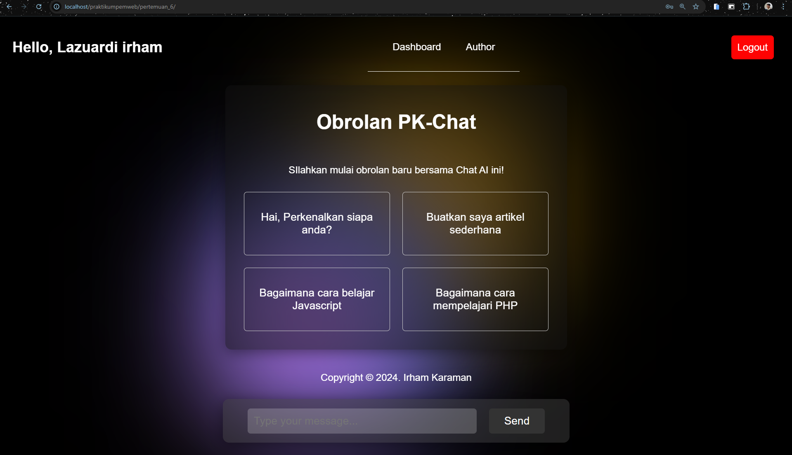

# PHP Chat AI

Proyek PHP Chat AI adalah aplikasi web sederhana yang mengimplementasikan chatbot AI menggunakan PHP. Aplikasi ini memanfaatkan session untuk menyimpan riwayat percakapan (`chatHistory`) dan status login pengguna (`login`), sehingga memungkinkan pengguna untuk melanjutkan topik obrolan sebelumnya selama sesi chat aktif.

## Fitur Utama
- Chatbot AI untuk berinteraksi dengan pengguna.
- Session `chatHistory` untuk menyimpan riwayat percakapan.
- Session `login` untuk mengelola status login pengguna.
- Tampilan yang responsif dan ramah pengguna.

## Tampilan Website

## Cara Menggunakan
1. Clone repositori ini: `git clone https://github.com/irhamkaraman/php-chat-ai.git`
2. Pindah ke direktori proyek: `cd php-chat-ai`
3. Buka aplikasi di browser dengan mengakses `index.php`.
4. Mulai berinteraksi dengan AI dan nikmati fitur chatbot yang disediakan.

## Kontribusi
Anda bisa melakukan kontribusi pada proyek ini dengan melakukan fork repositori ini, lalu buat pull request untuk perubahan yang diusulkan.

## Lisensi
Distribusi kode sumber ini dilisensikan di bawah [MIT License](LICENSE).

---

Terima kasih telah mengunjungi proyek PHP Chat AI. Untuk informasi lebih lanjut atau pertanyaan, silakan kunjungi halaman repositori [GitHub](https://github.com/irhamkaraman/php-chat-ai.git).
